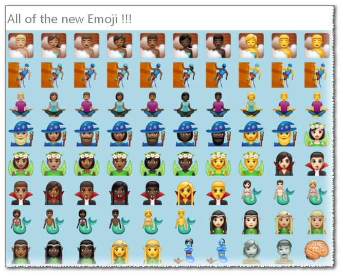
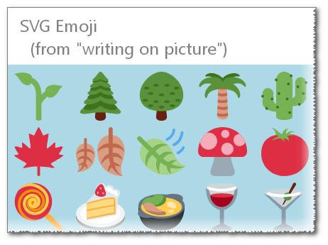

<h2><em>WhatsApp Emoji</em></h2>

 

About:
<ul>
<li>Emoji - PNG (probably what you want) [2,419 images].</li>
<li>Emoji - SVG (from the writing-on-picture feature) [259 images].</li>
<li>Other - Images that are part of the user-interface (mostly PNG, several resolutions available) [1,865 images]</li>
</ul>

 

 

Stuff you can do:

<ul>
<li>Watch everything at the live-<strong>preview</strong> page: <a href="https://eladkarako.com/whatsapp-emoji/">eladkarako.com/whatsapp-emoji/</a></li>
<li><a href="https://github.com/eladkarako/whatsapp-emoji/archive/master.zip">Download the entire thing</a> (~10MB)</li>
<li><a href="https://github.com/eladkarako/partial-download-github-repository">How To Download A Single Folder?</a></li>
<li>Gather it all yourself (developers): Download latest APK from <a href="https://www.apkmirror.com/apk/whatsapp-inc/">apkmirror.com/apk/whatsapp-inc</a>,
extract the content (<a href="https://github.com/eladkarako/mods/tree/master/7z">7zip</a>) and see <code>/res/drawable-nodpi-v4/</code>, <code>/assets/graphics/</code>,
<code>/res/drawable-hdpi-v4/</code>, <code>/res/drawable-xhdpi-v4/</code>, <code>/res/drawable-xxhdpi-v4</code> and <code>/res/drawable-xxxhdpi-v4/</code> for the image files.
</li>
<li>Donate: </li>
</ul>
